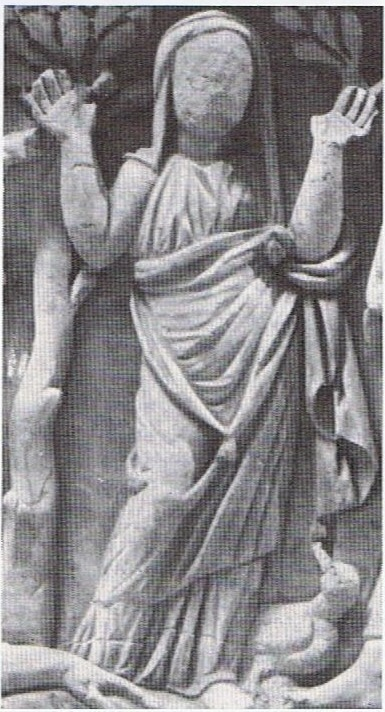
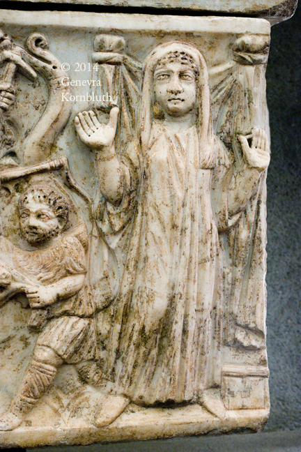

<!-- |  |  | -->

<!-- [Source](https://chandlerozconsultants.wordpress.com/category/sacraments/) -->

:::{admonition} 🎄 About this work
:icon: false
This work is a compilation of notes and reflections based on the lectures and readings from the course "Story of Christianity I" taught by Prof. Rylaarsdam at Calvin University in the Fall semester of 2025. The content is organized thematically and chronologically to provide a comprehensive overview of the early Christian church's history, challenges, and theological developments. The full content can be found on [the website](https://ericaraujo.com/storyOfChristianity/).
:::

:::{admonition} 📜 Lecture Notes
:icon: false

It was a great surprise to start this course with the question of what difference it makes if we stand, kneel, or sit to pray. The posture we assume when we pray is not a trivial matter. It reflects our understanding of who God is and who we are in relation to Him.

He also presented the three postures for prayer in the ancient church (and guess what? sitting was not one of them!): standing, kneeling, and prostrating. Each posture has its own meaning and significance:

- Standing is a posture of respect and attentiveness,
- Kneeling is a posture of humility and submission, and
- Prostrating is a posture of total surrender and worship, also connected to repentance.

Prof. Rylaarsdam also explained the origins of the expression "The Lord be with you", recalling Boaz's greeting to his workers in Ruth 2:4. This greeting is not just a polite expression; it carries deep theological significance. It acknowledges God's presence and blessing in our lives, especially in communal worship settings.
:::

:::{figure} figures/woman.jpg
:width: 300px
[Source](https://chandlerozconsultants.wordpress.com/category/sacraments/)
:::

This journal will include summaries of lectures, reflections on readings, and personal insights gained throughout the course. It aims to provide a comprehensive overview of the material covered and to deepen my understanding of the Christian faith and its historical context. The main goal is to inform myself and keep track of the knowledge acquired during this educational experience.

:::{figure} figures/VaticanMuseums_148.jpg
Grand Pastoral Sarcophagus" from Via Prenestina, painted and gilt, late 3rd/early 4th c. Vatican Museums, 31485 (ex 150) | [Source](https://www.kornbluthphoto.com/VaticanPastoralSarcophagus31485.html)
:::

## Introduction

The main question of this topic will be: Why study the history of Christianity? Or as stated by Prof. Rylaarsdam, "What difference does it make to know church history?"

It is quite common for seminary students to question the relevance of church history for their ministry. Some may see it as a mere academic exercise, while others may view it as a distraction from more practical concerns. However, studying church history is essential for several reasons, which will be explored in this topic.

:::{figure} /figures/stpeter.jpg
St Peter Preaching in the Presence of St Mark. Fra Angelico, c. 1440-41. [Source](https://en.wikipedia.org/wiki/Fra_Angelico#)
:::

## Reasons to Study Church History

To summarize, here are some of the key reasons to study church history:

1. **To understand our identity as Christians**: Church history helps us to see how our faith has been shaped and formed over the centuries. It reminds us that we are part of a larger story, a story that goes back to the early church and continues to this day.
2. **To learn from the past**: By studying church history, we can learn from the successes and failures of those who came before us. We can see how they navigated challenges and controversies, and we can apply those lessons to our own lives and ministries.
3. **To appreciate the diversity of the Christian tradition**: Church history reveals the rich diversity of the Christian tradition. It shows us how different cultures and contexts have shaped the way we understand and practice our faith.
4. **To deepen our faith**: Studying church history can deepen our faith by helping us to see the faithfulness of God throughout the ages. It reminds us that we are part of a larger story of God's work in the world.

Church history forms Christians for a missional encounter with culture as we observe how the church in the past did that. It is not just an academic exercise but a practical one that equips us to live out our faith in the world today.

## An Alien-tropological Experience

As we start studying church history, we may see our task as similar to that of an alien anthropologist trying to understand human culture. Imagine for a moment that you are an alien grad student in interplanetary religions, sent to Earth to study Christianity. You arrive on our planet with no prior knowledge of human history, culture, or religion. Your goal is to observe and analyze the practices, beliefs, and values of Christians throughout history. You are also short in funding, so you decide to focus on specific periods, coming back to your home planet to write reports after each visit.

:::{figure} figures/drwho.jpg
Dr. Who and the Daleks (1965). A good representation of an alien anthropologist visiting Earth.
:::

This exercise will help us understand the task of studying church history from a fresh perspective. By adopting the mindset of an alien anthropologist, we can approach church history with curiosity and openness, seeking to understand the "otherness" of past Christians.

By deriving our understanding of what are Christians from samples of different ages and places in church history, we can come to various conclusions about what Christianity is and how it has evolved over time. We can learn to appreciate the differences and similarities between our own context and that of past Christians. We can also see how the gospel has been communicated and lived out in different cultural settings.

After conducting our alien anthropological study of Christianity, we can ask ourselves:

- What should the grad student in Earthly Christianity conclude about this strange religion?

Can we see how Christianity has been remarkably adaptive and resilient throughout history? It has been able to take root in diverse cultures and contexts, while still maintaining its core message and identity. This adaptability is a testament to the power of the Christian faith and its ability to speak to the human condition across time and space.

Can we see how Christians have often found themselves as "resident aliens" ([paroikoi](#paroikoi)) in their own cultures? They have had to navigate the tension between celebrating the culture and embodying alternatives to it. This tension has shaped the way Christians have lived out their faith throughout history.

Can we see how the study of church history can inform our own faith and practice today? By learning from the successes and failures of past Christians, we can gain insights into how to live out our faith in our own context.

## How to Study Church History?

The question of how to study church history is crucial for our understanding of the faith. It is not enough to simply know the events and figures of church history; we must also approach it with the right perspective and methodology. Some quotes presented during the lecture help us to reflect on this question:

> In modernity, church history has often been taught not "in terms of the missionary advance in successive encounters of the gospel with different forms of human culture and society, but rather as a story of the doctrinal and other conflicts within the life of the church." (L. Newbigin)

> I wish someone had told me in seminary that the Christological and Trinitarian controversies of the second and third century were first and foremost issues of contextualization. (L. Newbigin)

> We have to ask in all sincerity whether the study of the history of the church ought not to be completely redesigned. (David Bosch)

These quotes highlight the importance of approaching church history with a missional and contextual perspective. We should not just focus on doctrinal disputes but also on how the gospel has been communicated and lived out in different cultural settings.

To provide a tool for studying church history, Prof. Rylaarsdam introduced us the two principles for missional encounters with culture:

(indigenizing-principle)=
1. **The indigenizing principle:** Christianity enters a culture and finds customs that embody the way of Christ. Christians celebrate the culture. They are residents in it.

(paroikoi)=
2. **The pilgrim principle:** Christianity enters a culture and finds ways in which the culture contradicts the way and teachings of Christ. Christians seek to embody alternatives. They are not fully at home; they are **resident aliens** (*paroikoi*) in it.

These two principles are constantly in tension with each other throughout church history. Christians have to navigate between celebrating the culture and embodying alternatives to it. And each generation has to discern how to live out these principles in their own context.

:::{admonition} My notes on *paroikoi*
:class: warning
The connection of the pilgrim principle and the idea of Christians as "resident aliens" (*paroikoi*) reminded me of 1 Peter 2:11-12: 

"*Dear friends, I urge you, as foreigners and exiles (*paroikoi*), to abstain from sinful desires, which wage war against your soul. Live such good lives among the pagans that, though they accuse you of doing wrong, they may see your good deeds and glorify God on the day he visits us.*"
:::

The biggest challenge presented for us is to pursue "faithful contextualization rather than syncretistic accommodation".

> Since the Gospel is translatable by its very nature, it can take on many cultural forms. In that translation the Gospel both affirms the creational good and judges the idolatrous twisting of all cultural forms. (Mike Goheen)

A framework for studying church history faithfully involves asking in each historical context:

1. What's my **context**?
2. What's the **gospel** in this context?
3. What's the **mission** of God's people in this context?
4. As a ministry **leader**, how can I equip people for mission in this context?

These questions help us to approach church history with a missional and contextual perspective, allowing us to learn from the past and apply those lessons to our own lives and ministries today. And they will be part of the following discussions throughout the course.
